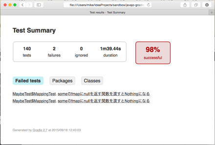
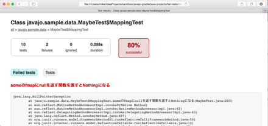
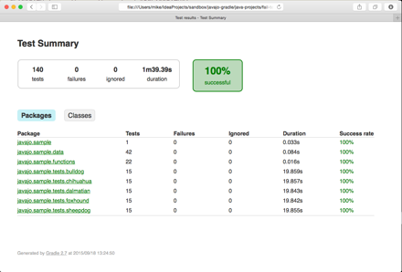

= テストについて

このセクションではJavaプロジェクトにおけるテストについて学習していきます。

.このセク書について
* やること
** `test` タスクの実行・設定を実際におこなう
* 達成してほしいこと
** `test` タスクの機能・設定を実際に覚えてもらって効果的なテストを実行できるようになる
* ディレクトリー
** `java-projects/fail-tests`

== テストが落ちる

`java-projects/fail-tests` は少々問題のあるプロジェクトです。早速ですがテストを実行してみてください。

=== 演習1

このプロジェクトのテストを実行してください。

テストは下記のコマンドで実行できます。

[source]
----
gradle test
----

このテストは次のようなメッセージを出力して終了します。

[source,text]
----
FAILURE: Build failed with an exception.

* What went wrong:
Execution failed for task ':java-projects:fail-tests:test'.
> There were failing tests. See the report at: file:///path/to/javajo-gradle/java-projects/fail-tests/build/reports/tests/index.html

* Try:
Run with --stacktrace option to get the stack trace. Run with --info or --debug option to get more log output.

BUILD FAILED

Total time: 1 mins 43.254 secs
----

テスト結果のレポートのURLが表示されるので、ブラウザーをひらいて見てみましょう。

.テストレポートサマリー

落ちたテスト名のリンクをクリックすると、実際のテストエラーの内容が表示されます。

.テストエラーの内容

テストが落ちた原因は次のようです。

.テストエラーの詳細
[source,text]
----
java.lang.NullPointerException
	at javajo.sample.data.MaybeTest$MappingTest.someのfmapにnullを返す関数を渡すとNothingになる(MaybeTest.java:205)
----

エラーのあった箇所を調べると、実装がまずそうですね。

=== 演習2

実装を修正した後、テストを再実行してください。

.ヒント
* 実装が間違っているのは `javajo.sample.data.MaybeBase` の121行目あたりです。
* インターフェース `Maybe<T>` のメソッド `fmap(Function<T, R> mapper)` では関数 `mapper` が `null` を返す場合は、メソッドとしては `Nothing` を返すことを求めています。
** 詳しくは `javajo.sample.data.Maybe` の71行目を参照ください。

.このようになれば成功です
[source]
----
$ gradle test
Picked up _JAVA_OPTIONS: -Dfile.encoding=UTF-8
:compileJava
:processResources
:classes
:compileTestJava
:processTestResources UP-TO-DATE
:testClasses
:test

BUILD SUCCESSFUL

Total time: 1 mins 42.378 secs
----

再び、先ほどのレポートをブラウザーで開いてみましょう。

.成功したテストのレポート

